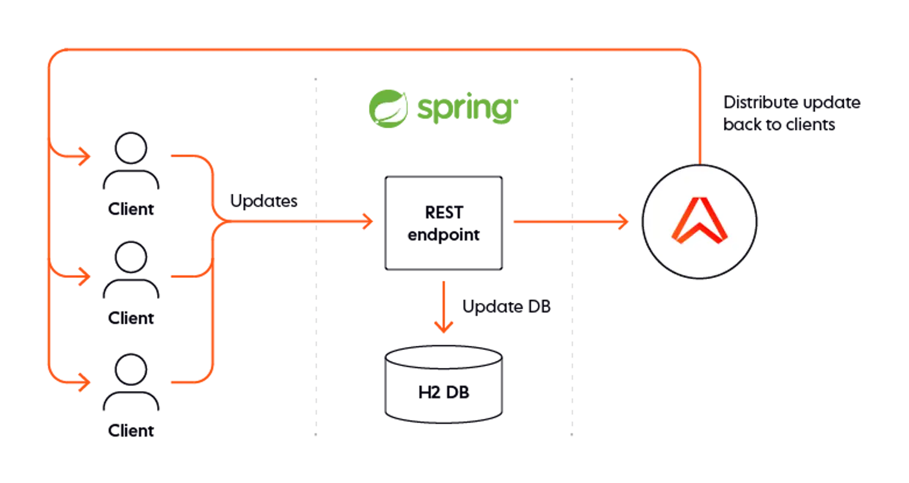

## WebSocket 

> See [websockets pubsub spring boot](https://ably.com/blog/websockets-pubsub-spring-boot)

WebSockets allow for ***bi-directional communication*** between the ***clients*** and the ***server***. Once a client established a connection to your server, the server is free to ***send updates to the clients*** whenever an update is available. This ends up being far more efficient, and also ensures updates are being sent to clients as soon as possible.

### What is Pub/Sub?

Publish/Subscribe (Pub/Sub) is a paradigm in which you decouple clients and servers from one another. Rather than a server having to keep track of which clients to send messages to, you instead have clients subscribe to entities known as ‘channels’, and the server (or clients, depending on your use case!) publish messages to that channel. Some middleware or server is then responsible for routing messages published to a channel to all clients who’ve subscribed to it.





<!--
creating a simple collaborative TODO list. Anyone will be able to add new TODOs, remove them, and mark them completed/incomplete. These events will be communicated over WebSockets, and make use of [Ably](https://ably.com/) to handle our Pub/Sub. We’ll make use of H2 to store our data, and wrap it up in a Docker container to make it easily deployable.
-->

### Test 


<details open><summary><i>create todo</i></summary><blockquote>

```sh
curl -s -X POST http://localhost:8080/api -H 'Content-Type: application/json' --cookie "username=farhad" -d'
{
   "text": "I am farhad!"
}'; echo
```

<details><summary><i>Response</i></summary>

```json
{"id":1,"text":"I am farhad!","userName":"farhad","complated":false}
```

</details>

</blockquote></details>

---

<details open><summary><i>create todo</i></summary><blockquote>

```sh
curl -s -X POST http://localhost:8080/api -H 'Content-Type: application/json' --cookie "username=ali" -d'
{
  "text": "I am ali!"
}'; echo
```

<details><summary><i>Response</i></summary>

```json
{"id":2,"text":"I am ali!","userName":"ali","complated":false}
```

</details>

</blockquote></details>

---

<details open><summary><i>create todo</i></summary><blockquote>

```sh
curl -s -X POST http://localhost:8080/api -H 'Content-Type: application/json' --cookie "username=karim" -d'
{
  "text": "I am karim!"
}'; echo
```

<details><summary><i>Response</i></summary>

```json
{"id":3,"text":"I am karim!","userName":"karim","complated":false}
```

</details>

</blockquote></details>

---


<details open><summary><i>Get all todos</i></summary><blockquote>

```sh
curl -s -X GET http://localhost:8080/api -H 'Content-Type: application/json'| jq '.'
```

<details><summary><i>Response</i></summary>

```json
[
  {
    "id": 1,
    "text": "I am farhad!",
    "userName": "farhad",
    "complated": false
  },
  {
    "id": 2,
    "text": "I am ali!",
    "userName": "ali",
    "complated": false
  },
  {
    "id": 3,
    "text": "I am karim!",
    "userName": "karim",
    "complated": false
  }
]
```

</details>

</blockquote></details>

---

<details open><summary><i>delete todo(username not match)</i></summary><blockquote>

```sh
curl -s -X DELETE http://localhost:8080/api/3 -H 'Content-Type: application/json' --cookie "username=farhad"  ; echo
```

</blockquote></details>

---

<details open><summary><i>Get all todos</i></summary><blockquote>

```sh
curl -s -X GET http://localhost:8080/api -H 'Content-Type: application/json'| jq '.'
```

<details><summary><i>Response</i></summary>

```json
[
  {
    "id": 1,
    "text": "I am farhad!",
    "userName": "farhad",
    "complated": false
  },
  {
    "id": 2,
    "text": "I am ali!",
    "userName": "ali",
    "complated": false
  },
  {
    "id": 3,
    "text": "I am karim!",
    "userName": "karim",
    "complated": false
  }
]
```

</details>

</blockquote></details>

---

<details open><summary><i>Delete todo (username matched)</i></summary><blockquote>

```sh
curl -s -X DELETE http://localhost:8080/api/3 -H 'Content-Type: application/json' --cookie "username=karim"  ; echo
```

</blockquote></details>

---

<details open><summary><i>Get all todos</i></summary><blockquote>

```sh
curl -s -X GET http://localhost:8080/api -H 'Content-Type: application/json'| jq '.'
```

<details><summary><i>Response</i></summary>

```json
[
  {
    "id": 1,
    "text": "I am farhad!",
    "userName": "farhad",
    "complated": false
  },
  {
    "id": 2,
    "text": "I am ali!",
    "userName": "ali",
    "complated": false
  }
]
```

</details>

</blockquote></details>

---

<details open><summary><i>login and redirect to all todos</i></summary><blockquote>

```sh
curl -L -s -X GET http://localhost:8080/auth/login?username=farhad -H 'Content-Type: application/json' | jq '.'
```

<details><summary><i>Response</i></summary>

```json
[
  {
    "id": 1,
    "text": "I am farhad!",
    "userName": "farhad",
    "complated": false
  },
  {
    "id": 2,
    "text": "I am ali!",
    "userName": "ali",
    "complated": false
  }
]
```

</details>

</blockquote></details>

---

<details open><summary><i>logout and redirect to all todos</i></summary><blockquote>

```sh
curl -L -s -X GET http://localhost:8080/auth/logout -H 'Content-Type: application/json' --cookie "username=farhad" | jq '.'
```

<details><summary><i>Response</i></summary>

```json
[
  {
    "id": 1,
    "text": "I am farhad!",
    "userName": "farhad",
    "complated": false
  },
  {
    "id": 2,
    "text": "I am ali!",
    "userName": "ali",
    "complated": false
  }
]
```

</details>

</blockquote></details>

---

